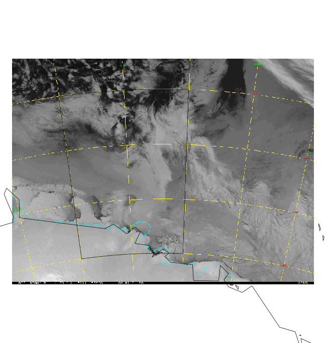

# asosi
Obtain Antarctic and Southern Ocean Sea Ice imagery from the BOM

This is a rough prototype and only some of the parameters are built in and generalized properly. Work in progress. 

Only D'Urville will work for now. 

Proof that D'Urville does work: 

```R
library(asosi)
x <- getbom(as.Date("2015-07-30"), region = "Durville")
plot(x)
library(maptools)
library(rgdal)
data(wrld_simpl)
w <- spTransform(wrld_simpl, projection(x))
plot(w, add = TRUE)
library(graticule)
g <- graticule(c(140, 150), c(-62, -68), proj = projection(x))
plot(g, add = TRUE)
writeRaster(x, "IDTE9232.0730.7D.tif")
```

