<!-- README.md is generated from README.Rmd. Please edit that file -->
asosi
=====

Obtain Antarctic and Southern Ocean Sea Ice imagery from the BOM

This is a rough prototype and only some of the parameters are built in and generalized properly. Work in progress.

TODO
----

-   allow ability to put .gfw and .prj (or .vrt) next to original GIF
-   Allow control over which image (9D, 8D, 7D, etc.)
-   remove dependence on rgdal by hardcoding projected control points into package
-   build more visualization examples

Installation
============

Install with devtools.

``` r
devtools::install_github("mdsumner/asosi")
```

Examples
========

``` r
library(asosi)
library(rworldxtra)
data(countriesHigh)
library(rgdal)
ant <- subset(countriesHigh, SOVEREIGNT == "Antarctica")
library(graticule)
durv <- asosi(as.Date("2015-07-30"), region = "durville")
#> Warning in download.file(fname, tfile, mode = "wb"): cannot open: HTTP
#> status was '404 Not Found'
durvmap <- spTransform(ant, projection(durv))
durvgrat <- graticule(seq(135, 160, by = 5), seq(-70, -60, by = 2), proj = projection(durv))
plot(durv, addfun = function() {plot(durvmap, add = TRUE); plot(durvgrat, add = TRUE)}, maxpixels = ncell(durv))
```

 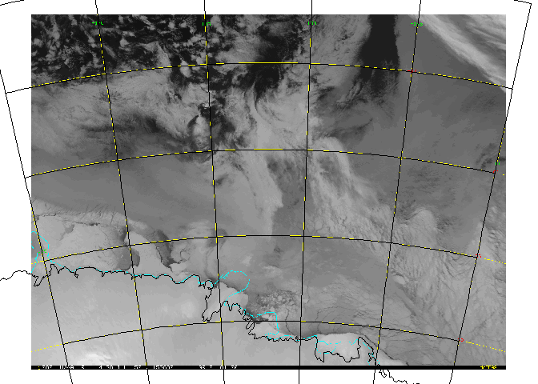

``` r
#writeRaster(durv, gsub(".gif", ".tif", basename(durv)))

regions <- c(
    "casey", "davis", "durville", "mawson", "shackleton", "terranova",
    "westice", "ragnhild", "enderby", "capeadare", "sabrina"
  )
for (jj in seq_along(regions)) {
  simap <- asosi(region = regions[jj])
  elx <- extent(projectExtent(simap, "+proj=longlat +ellps=WGS84"))
  lon <- seq((xmin(elx) %/% 5) * 5, ((xmax(elx) %/% 5) + 1) * 5, by = 5)
  lat <- seq((ymin(elx) %/% 2) * 2, (ymax(elx) %/% 2 + 1) * 2, by = 2)
  ## put this in the function as a return property
  date <- as.Date(paste(format(Sys.Date(), "%Y"), substr(basename(filename(simap)), 10, 13)), "%Y %m%d")
  map <- spTransform(ant, projection(simap))
  grat <- graticule(lon, lat, proj = projection(simap), nverts = 80)
  plot(simap, addfun = function() {plot(map, add = TRUE); plot(grat, add = TRUE)}, maxpixels = ncell(simap))
  title(sprintf("%s %s", regions[jj], format(date)), line = -1.5, bg = "grey")
}
```

 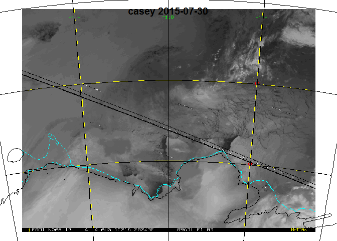  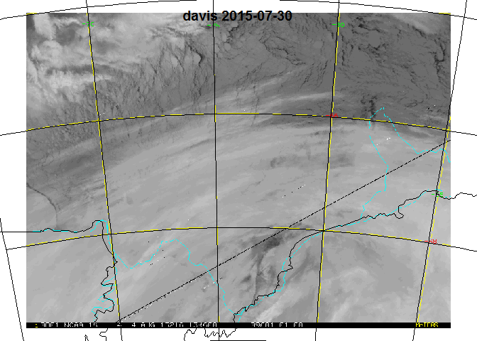  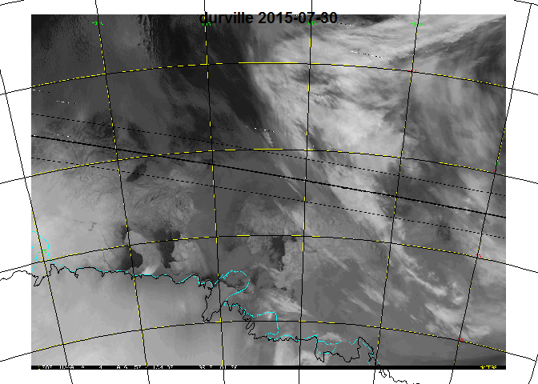  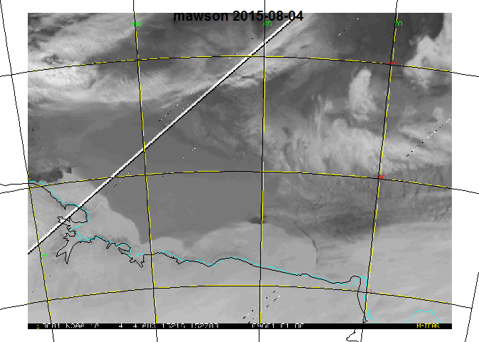  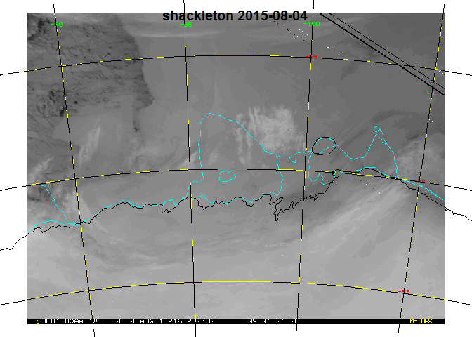  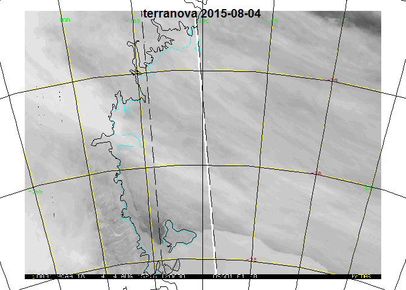  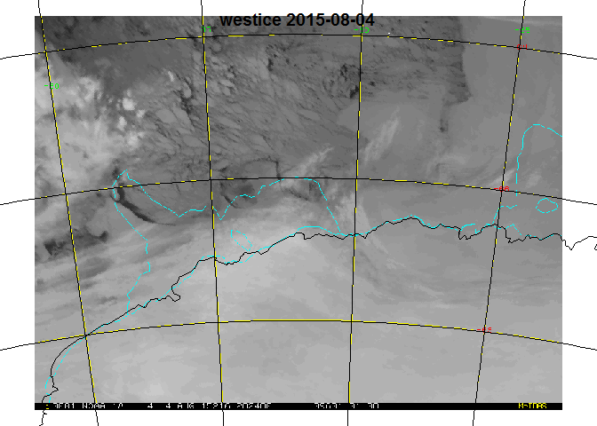  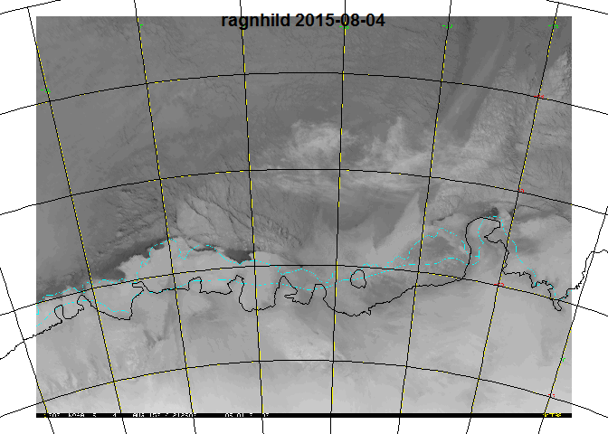  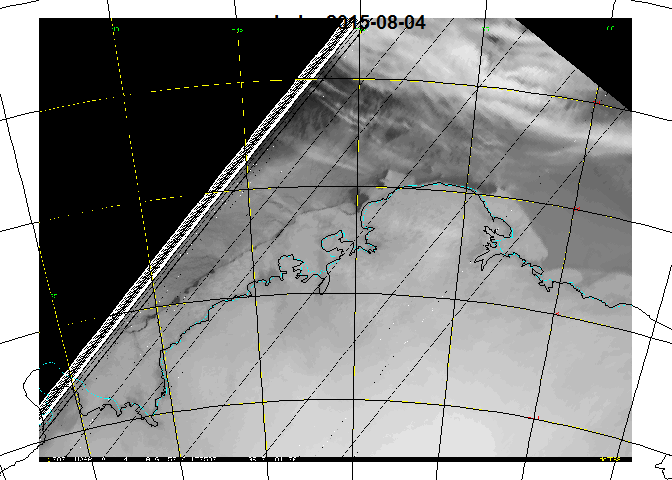  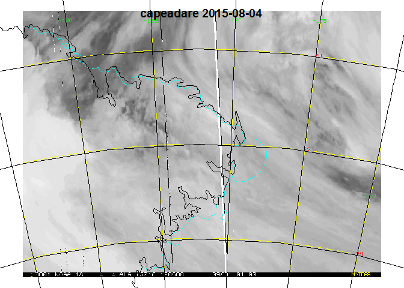  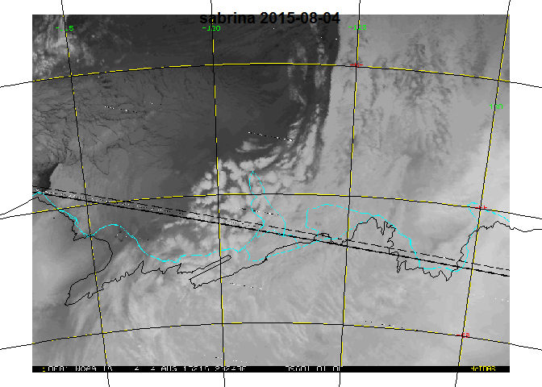
